<picture>
  <source media="(prefers-color-scheme: dark)" srcset="assets/headings/cmd-hi-im-soph-dark.svg" />
  
</picture>

<picture>
  <source media="(prefers-color-scheme: dark)" srcset="assets/headings/recap-dark.svg" />
  
</picture>

Humans consume information.  
Agents execute information.  
I build the infrastructure that converts one into the other.

<picture>
  <source media="(prefers-color-scheme: dark)" srcset="assets/headings/cmd-building-with-dark.svg" />
  
</picture>

 
 

  
  &nbsp;
  <picture>
    <source media="(prefers-color-scheme: dark)" srcset="assets/logos/openai-dark.svg" />
    
  </picture>
  &nbsp;
  <picture>
    <source media="(prefers-color-scheme: dark)" srcset="assets/logos/mcp-dark.svg" />
    
  </picture>
  &nbsp;
  
  &nbsp;
  <picture>
    <source media="(prefers-color-scheme: dark)" srcset="assets/logos/langchain-dark.svg" />
    
  </picture>
  &nbsp;
  <picture>
    <source media="(prefers-color-scheme: dark)" srcset="assets/logos/langgraph-dark.svg" />
    
  </picture>
  &nbsp;
  <picture>
    <source media="(prefers-color-scheme: dark)" srcset="assets/logos/transformers-dark.svg" />
    
  </picture>
  &nbsp;
  
  &nbsp;
  
  &nbsp;
  
  &nbsp;
  <picture>
    <source media="(prefers-color-scheme: dark)" srcset="assets/logos/rust-dark.svg" />
    
  </picture>
  &nbsp;
  
  &nbsp;
  <picture>
    <source media="(prefers-color-scheme: dark)" srcset="assets/logos/github-dark.svg" />
    
  </picture>
  &nbsp;
  
  &nbsp;
  <picture>
    <source media="(prefers-color-scheme: dark)" srcset="assets/logos/vercel-dark.svg" />
    
  </picture>

<picture>
  <source media="(prefers-color-scheme: dark)" srcset="assets/headings/cmd-currently-working-on-dark.svg" />
  
</picture>

  

<h4 align="center">Ship production-grade software with AI workers.</h4>

AI coding tools make code easy to generate. Promix helps engineering teams ship production-grade code with AI workers.

Install Promix, give it your project context and way of working, and start running AI workers in minutes.

Humans decide what ships. Promix gives AI workers the roles, memory, and checks they need to produce work teams can trust.

Any AI coding assistant can become a way to run Promix workers.

**AI workers do the work. Promix makes it shippable.**

  

<h4 align="center">Capture knowledge once. Your agents apply it.</h4>

Mnemos is a knowledge pipeline that transforms what you learn into actionable context for AI agents.

Your agent doesn't know the article you read this morning, the framework you discovered last week, or the decision you made yesterday.

Mnemos changes that.

Before every session, it briefs your agent with what matters now, surfaces relevant knowledge automatically, synthesizes reusable rules, and generates implementation plans.

Most knowledge tools help humans remember.

**Mnemos helps AI agents execute.**

→ https://github.com/Soph20/mnemos-capture

  

<h4 align="center">AI-native pet care platform</h4>

AI-native pet care platform combining triage, veterinary booking, subscriptions, services, and payments.

The interesting part is the architecture.

Emergency requests are classified deterministically before any LLM is invoked using multilingual keyword matching and semantic embeddings, prioritizing recall where false negatives are unacceptable.

<picture>
  <source media="(prefers-color-scheme: dark)" srcset="assets/headings/cmd-expertise-dark.svg" />
  
</picture>

I work at the intersection of agentic systems and the infrastructure that makes them dependable.

My focus is on multi-agent architectures, context engineering, and the knowledge infrastructure that enables AI agents to accumulate, organize, and reason over information through institutional memory, ontologies, and graph-based representations.

Powering those systems is the runtime infrastructure: evaluation, observability, orchestration, MCP integrations, and developer tooling that keep agents reliable across production environments and long-running workloads.

<picture>
  <source media="(prefers-color-scheme: dark)" srcset="assets/headings/cmd-principles-dark.svg" />
  
</picture>

- Context is infrastructure.
- Institutional memory compounds.
- Prompts are software.
- Evaluation beats intuition.
- Thin runtimes outlast thick frameworks.
- Design systems with AI at the core, not at the edge.
- Build the tools you wish existed.

<picture>
  <source media="(prefers-color-scheme: dark)" srcset="assets/headings/cmd-about-dark.svg" />
  
</picture>

Seven years shipping APIs, developer platforms, and production software.

Trilingual &nbsp;   

Quoted in Forbes Centroamérica for work on HoliPet and the LATAM PetTech ecosystem.

I build products at the intersection of AI systems, knowledge infrastructure, and real-world impact.

Always exploring better ways for humans and technology to work together.

<picture>
  <source media="(prefers-color-scheme: dark)" srcset="assets/headings/cmd-connect-dark.svg" />
  
</picture>

  
  &nbsp;
  

