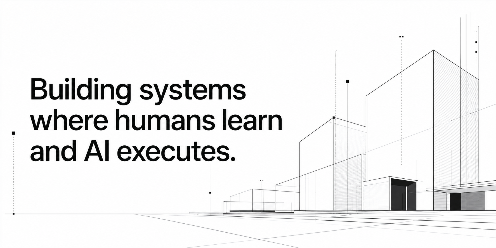
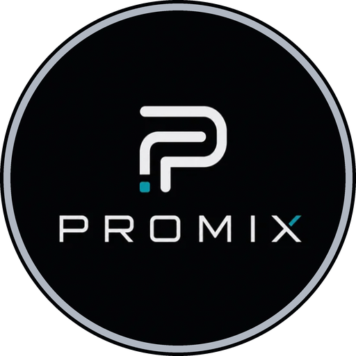
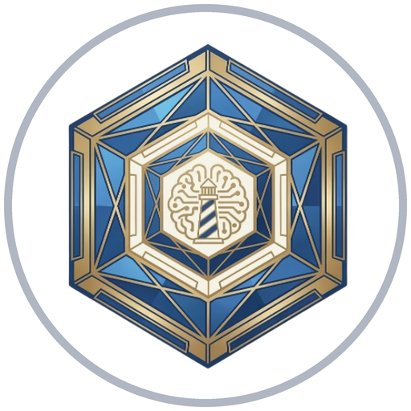

# Hi, I'm Soph

Humans consume information.  
Agents execute information.  
I build the infrastructure that converts one into the other.

  

### Building With

  
  &nbsp;
  <picture>
    <source media="(prefers-color-scheme: dark)" srcset="assets/logos/openai-dark.svg" />
    
  </picture>
  &nbsp;
  <picture>
    <source media="(prefers-color-scheme: dark)" srcset="assets/logos/mcp-dark.svg" />
    
  </picture>
  &nbsp;
  
  &nbsp;
  
  &nbsp;
  <picture>
    <source media="(prefers-color-scheme: dark)" srcset="assets/logos/rust-dark.svg" />
    
  </picture>
  &nbsp;
  <picture>
    <source media="(prefers-color-scheme: dark)" srcset="assets/logos/github-dark.svg" />
    
  </picture>
  &nbsp;
  
  &nbsp;
  <picture>
    <source media="(prefers-color-scheme: dark)" srcset="assets/logos/vercel-dark.svg" />
    
  </picture>

### Currently working on

  

<h4 align="center">The Operating System for AI Workforces</h4>

Promix is a production runtime for AI-native teams.

It provides specialized agents, institutional memory, reusable skills, quality gates, MCP integration, multi-provider routing, and standalone execution.

The runtime is intentionally thin. The intelligence lives in prompts, skills, and evaluation—not framework code—because models improve faster than runtimes.

Every system on this page is built on the principles behind Promix.

  

<h4 align="center">Capture knowledge once. Your agents apply it.</h4>

Mnemos is a knowledge pipeline that transforms what you learn into actionable context for AI agents.

Your agent doesn't know the article you read this morning, the framework you discovered last week, or the decision you made yesterday.

Mnemos changes that. Capture knowledge once.

Mnemos extracts it, stores it as Markdown in your own GitHub repository, and serves it through MCP to any compatible agent.

Before every session, it briefs your agent with what matters now, surfaces relevant knowledge automatically, synthesizes reusable rules, and generates implementation plans.

Most knowledge tools help humans remember.

**Mnemos helps AI agents execute.**

→ https://github.com/Soph20/mnemos-capture

  

<h4 align="center">AI-native pet care platform</h4>

AI-native pet care platform combining triage, veterinary booking, subscriptions, services, and payments.

The interesting part is the architecture.

Emergency requests are classified deterministically before any LLM is invoked using multilingual keyword matching and semantic embeddings, prioritizing recall where false negatives are unacceptable.

→ https://holipet.io

### Expertise

- Multi-Agent Systems
- Context Engineering
- Institutional Memory
- Agent Evaluation
- AI Infrastructure
- MCP
- Production AI
- Developer Tooling

Also exploring agent memory, context engineering, context memory graphs, evaluation, and long-running AI systems.

### Principles

- Context is infrastructure.
- Institutional memory compounds.
- Prompts are software.
- Evaluation beats intuition.
- Thin runtimes outlast thick frameworks.
- Design systems with AI at the core, not at the edge.
- Build the tools you wish existed.

### About

Founder building AI-native infrastructure.

Seven years shipping APIs, developer platforms, and production software.

Trilingual &nbsp;   

Quoted in Forbes Centroamérica for work on HoliPet and the LATAM PetTech ecosystem.

I build products at the intersection of AI systems, knowledge infrastructure, and real-world impact.

Always exploring better ways for humans and technology to work together.

  
  &nbsp;
  

