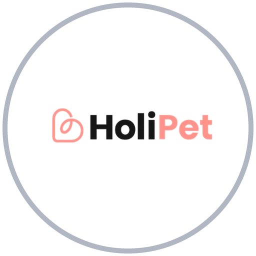

# Hi, I'm Soph

**I build AI tools for developers.**

I've spent seven years building APIs, developer tools, and software people use. My background is in product. I built the products below, from deciding what to build to designing the systems, writing the code, and testing them.

## What I'm building

### xkg

I'm building a knowledge graph that connects what people know with what their AI agents can use.

Today, xkg saves research, notes, and decisions in your GitHub repo and makes them available to AI tools through MCP. You own the files and choose your AI provider.

I'm developing the graph to connect facts to their sources, track how they change over time, and keep unreviewed AI guesses out of trusted context. The next step is to test whether following those connections gives better answers than keyword search. Later, the graph will record what was tried and what worked.

[Try it](https://mnemos-capture.vercel.app) · [Code](https://github.com/xmu-labs/xkg) · [Get started](https://github.com/xmu-labs/xkg#start-here) · [Connect your tools](https://github.com/xmu-labs/xkg#connect-your-ai-workers)

### xmu — in development

A tool for running AI agents with limits on spending and tool use.

I designed and built the agent loop in TypeScript and the event log in Rust. The log records activity without rewriting earlier entries. I wrote shared tests to check that the TypeScript and Rust event logs behave the same way.

The system checks spending limits and tool approvals. It also compares agent results and costs across AI providers.

The code is private and still in development.

### HoliPet

An AI assistant that helps people care for their pets.

I founded and built HoliPet. Forbes Centroamérica mentioned it and quoted me in an article about pet care businesses in Latin America.

[Demo](https://app.holipet.io/demo) · [Forbes article](https://forbescentroamerica.com/2025/07/17/pettech-una-industria-que-crece-y-representa-nuevas-oportunidades-de-negocio-en-latinoamerica/)

## How I work

I use AI coding tools, review their changes, and test the results. I compare approaches before adding more code.

I build tools that let users keep their data and switch AI providers.

## Get in touch

[LinkedIn](https://linkedin.com/in/sofia-padron-valdez) · [Email](mailto:sofia@spvtechnology.com)

I speak Spanish, English, and French.
